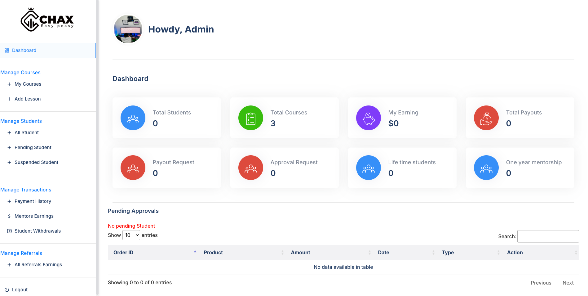

# E-Learning Platform for Chaxthekingmaker

A comprehensive e-learning platform built with Laravel, designed to manage courses, instructors, and students effectively. This project demonstrates a full-stack web application architecture using the LAMP stack.

---

## 🚀 Key Features

*   **Course Management:** Create, Read, Update, and Delete (CRUD) functionality for educational courses.
*   **User Roles:** Separate roles and permissions for administrators, instructors, and students.
*   **Student Enrollment:** Students can browse and enroll in available courses.
*   **Instructor Dashboards:** Instructors can manage their own courses and view student progress.
*   **Secure Authentication:** Built-in user registration and login system using Laravel's security features.

---

## 🛠️ Tech Stack

*   **Backend:** PHP, Laravel
*   **Frontend:** Blade (Laravel's templating engine), HTML, CSS, JavaScript
*   **Database:** MySQL
*   **Server:** Apache/Nginx

---

## 📸 Screenshots



---

## ⚙️ Setup and Installation

To run this project locally, follow these steps:

1.  **Clone the repository:**
    ```bash
    git clone https://github.com/mnanjwan/E-Learning-Platform-for-Chaxthekingmaker.git
    ```
2.  **Navigate to the project directory:**
    ```bash
    cd E-Learning-Platform-for-Chaxthekingmaker
    ```
3.  **Install dependencies:**
    ```bash
    composer install
    ```
4.  **Create your environment file:**
    ```bash
    cp .env.example .env
    ```
5.  **Generate an application key:**
    ```bash
    php artisan key:generate
    ```
6.  **Configure your `.env` file** with your database credentials (DB_DATABASE, DB_USERNAME, DB_PASSWORD ).

7.  **Run database migrations:**
    ```bash
    php artisan migrate
    ```
8.  **Start the development server:**
    ```bash
    php artisan serve
    ```

---
